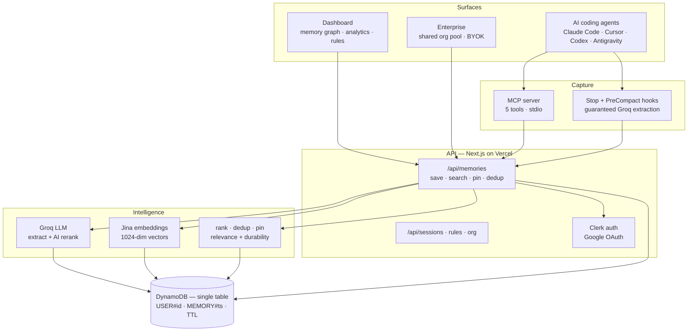
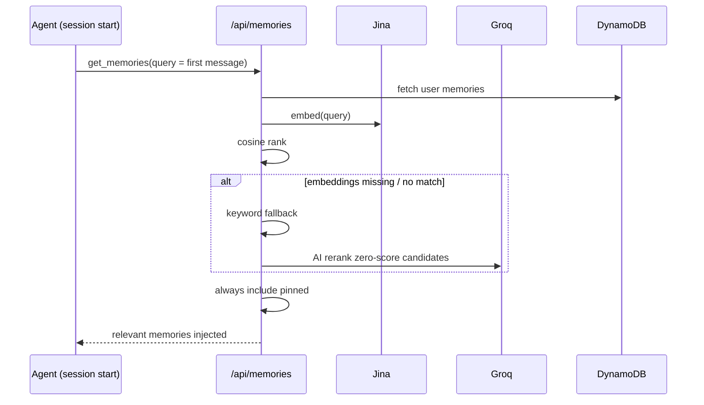

# Imprint — System Architecture

> One persistent memory layer that lives under every AI coding agent you use — Claude Code, Cursor, Codex, Antigravity — so your context follows you across tools and machines instead of resetting every session.

**Live:** [imprint-ebon.vercel.app](https://imprint-ebon.vercel.app)

---

## System overview



*Legend: data flows **down** to save (write path) and **up** to retrieve (read path). Every surface reads and writes the same store.*

---

## The five layers

### 1. Surfaces
- **AI coding agents** — Claude Code, Cursor, Codex, Antigravity, and any MCP-capable IDE. Each registers the MCP server in its own config file (`~/.claude.json`, `~/.cursor/mcp.json`, `~/.codex/config.toml`, `~/.gemini/config/mcp_config.json`).
- **Dashboard** — Next.js web app at `/dashboard`: live memory graph, source analytics, session history, and per-topic memory rules.
- **Enterprise** — a shared org memory pool; every member's session receives personal **and** org memories. Bring-your-own Anthropic key, AES-256 encrypted.

### 2. Capture — two layers, never loses a fact
- **MCP server** (`mcp/server.js`, stdio) exposes five tools: `get_memories`, `save_memory`, `search_memories`, `delete_memory`, `pin_memory`. Tool descriptions instruct the agent to retrieve with `query` at session start and save proactively.
- **Stop + PreCompact hooks** (`mcp/extract-and-save.js`) fire after every response and before context compaction, running Groq extraction so memories are captured **even when the model forgets to call `save_memory`**.

### 3. API — Next.js on Vercel (serverless)
- `/api/memories` — `GET` (semantic / keyword / optimize), `POST` (direct save + batch extraction), `PATCH` (pin / edit), `DELETE`.
- `/api/sessions`, `/api/rules`, `/api/org`, `/api/user`, `/api/keys`.
- **Clerk** authentication (Google OAuth); routes protected by middleware.

### 4. Intelligence
- **Groq** (`llama-3.3-70b`) extracts memories from conversation; `llama-3.1-8b-instant` reranks zero-score candidates during retrieval.
- **Jina** embeds every memory at 1024 dimensions (`retrieval.passage` for stored facts, `retrieval.query` for searches).
- **Ranking / dedup / pin** — pinned float to the top, recency decay (~14-day half-life), access boost; dedup on save (prefix + cosine > 0.92).

### 5. Storage
- **DynamoDB single-table** design. Memories carry a 30-day TTL when unpinned; **pinned memories drop their TTL and are permanent**.

---

## Data flows

### Save (write path)

```mermaid
sequenceDiagram
  participant U as You (in IDE)
  participant A as Agent
  participant H as Stop hook
  participant API as /api/memories
  participant J as Jina
  participant DB as DynamoDB
  U->>A: chat / code
  A->>API: save_memory(fact)
  H-->>API: extract + save (guaranteed)
  API->>J: embed(content)
  API->>API: dedup — prefix + cosine > 0.92
  API->>DB: put (TTL 30d; none if pinned)
```

### Retrieve (read path)



---

## Retrieval pipeline — 3-tier cascade

| Tier | Method | Score | When |
|------|--------|-------|------|
| 1 | Jina embedding cosine similarity | 0.0–1.0 | memory has a stored vector |
| 2 | Keyword match (content + keywords) | 0.25–0.5 | no vector, query words match |
| 3 | Groq AI rerank | 0.15 | no vector, no keyword match |

Pinned memories are merged into **every** result set, pinned-first — they can never be filtered out by relevance limits.

---

## Data model — DynamoDB single table

| Item | PK | SK | Key fields |
|------|----|----|------------|
| Memory | `USER#userId` | `MEMORY#createdAt#memoryId` | content, topic, pinned, keywords, confidence, source, embedding, contradicts[], ttl |
| Session | `USER#userId` | `SESSION#createdAt#sessionId` | title, messageCount, memoriesExtracted |
| Memory rules | `USER#userId` | `MEMORY_RULES` | rules[] (label, topic, enabled, keywords, pattern) |
| User | `USER#userId` | `PROFILE` | tier, encryptedApiKey, orgId |
| Org | `ORG#orgId` | `PROFILE` | name, memberIds[] |

TTL: 30 days for unpinned memories, none for pinned.

---

## Tech stack

| Layer | Tech |
|-------|------|
| Frontend + Dashboard | Next.js 16 (App Router), Vercel |
| Auth | Clerk (Google OAuth) |
| Database | AWS DynamoDB (single-table) |
| Memory extraction | Groq API (`llama-3.3-70b`) + regex fallback |
| Embeddings / retrieval | Jina AI (1024-dim) |
| MCP server | Node.js, `@modelcontextprotocol/sdk` |
| Capture hooks | Groq API + regex fallback |

---

## Why it wins

- **One store, every surface.** The same DynamoDB table feeds four IDEs, the dashboard, and an enterprise pool. Switch editors — keep your memory. No competitor spans IDEs like this.
- **Two-layer capture.** Agent calls *and* a guaranteed Stop/PreCompact hook — belt and suspenders, so a fact is never lost to a forgetful model.
- **Relevance, not recency.** A 3-tier retrieval cascade with always-injected pinned facts solves "pull the *right* memory," not just the latest.
- **Durable by design.** Pinned = permanent (no TTL); unpinned decays at 30 days; saves are de-duplicated so the store stays clean.
- **Serverless, scale-to-zero.** DynamoDB + Vercel functions = near-zero idle cost, instant scale. Enterprise BYOK keeps data and keys customer-owned.

---

## Security

- Clerk authentication; API routes gated by middleware.
- AES-256 encryption for stored API keys.
- Memory rules default privacy-first (personal / health / relationships off by default).
- Memories namespaced per `userId`; org memories isolated under `ORG#orgId`.
