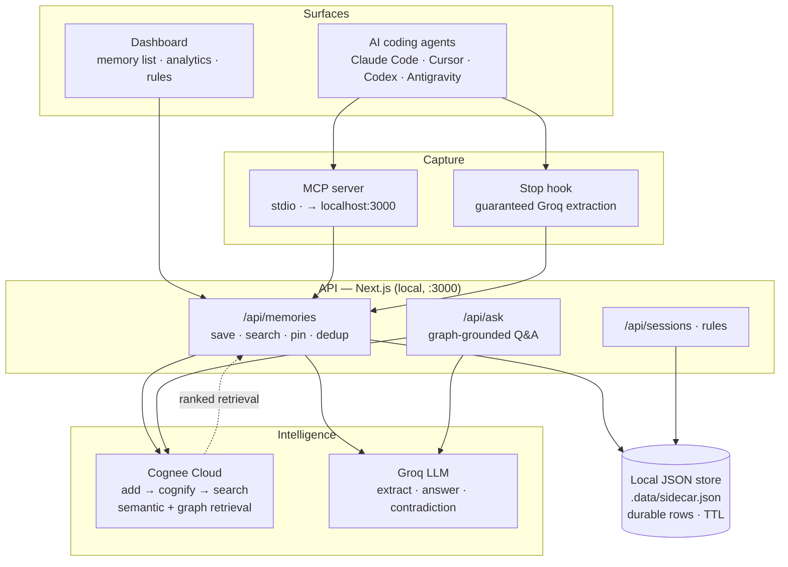

# Imprint — Persistent Memory for Every AI Coding IDE

> Your AI coding assistant finally remembers you — across every IDE you use.

Imprint gives AI coding assistants a persistent memory that survives across every session. Work naturally — Imprint silently extracts the durable facts, stores them in the cloud, and injects the relevant ones back into your next session. A fact you teach in one IDE is instantly available in the others.

---

## The Problem

Every new AI session starts from zero. Your name, your stack, your projects, your preferences — forgotten. You repeat yourself every single session. The model is brilliant but amnesiac.

Imprint fixes that permanently — and across **every** IDE, not just one.

---

## One Memory Layer, Two Surfaces

| | Tier 1 — Developer | Tier 2 — Enterprise |
|---|---|---|
| **How** | MCP server (local) | Web app + BYOK |
| **Surface** | Claude Code · Cursor · Codex · Antigravity | Any MCP IDE, org-wide |
| **Memory scope** | Personal | Shared org pool |
| **Setup** | One CLI command | Invite link |
| **Target** | Developers, researchers | Teams, agencies |

**The insight:** most memory tools serve one audience and one tool. Imprint scales from a solo developer to an enterprise team — and spans every MCP-capable IDE — on one shared memory store (Cognee Cloud for retrieval + a local/DynamoDB backing for durable rows), zero migration.

---

## Why Imprint Is Different

Most "AI memory" today falls into two camps:

- **Developer SDKs / engines** — building blocks you wire into your *own* app (mem0, Zep, Letta/MemGPT, Cognee). Powerful, but you have to design and host the memory experience yourself.
- **Single-vendor memory** — memory locked inside one product (Cursor's memory, ChatGPT memory, Claude Projects). Convenient, but it never leaves that tool.

Imprint is neither. It's an **end-user memory layer that spans the AI tools you already use**: install one MCP server and Claude Code, Cursor, Codex, and Antigravity instantly share the same memory — no code to write, no single vendor to commit to.

| | Single-vendor memory<br/>(Cursor · ChatGPT · Claude) | Memory SDKs / engines<br/>(mem0 · Zep · Letta · Cognee) | **Imprint** |
|---|---|---|---|
| Shared memory across different IDEs | ❌ locked to one tool | ⚙️ only if you build it | ✅ one memory, every MCP IDE |
| Setup | built-in but siloed | write code / host a service | ✅ one CLI command, zero code |
| Capture reliability | model-dependent | you implement it | ✅ guaranteed Stop hook + AFK summaries |
| Inspect / edit your memory | ❌ black box | ⚙️ build your own UI | ✅ dashboard: graph · rules · pinning |
| Self-correcting | ❌ | ⚙️ DIY | ✅ contradiction detection on every save |
| Solo → team | ❌ | varies | ✅ same backend, org pool + BYOK |

**The three things Imprint does that the others don't do *together*:**

1. **Portability across IDEs.** A fact you teach in Claude Code is instantly available in Cursor, Codex, and Antigravity. Your context follows *you*, not a vendor.
2. **Guaranteed capture.** Memory doesn't depend on the model remembering to save — a Stop hook extracts durable facts after *every* response, plus an AFK summary when you return from a break.
3. **Memory you can see and own.** A live dashboard lets you inspect the memory graph, set per-topic rules, pin what matters, and resolve contradictions — instead of trusting a black box.

> Engines like **Cognee** provide the graph-and-vector memory *brain*; Imprint is the *experience* on top — the cross-IDE reach, the guaranteed capture, and the dashboard that make memory portable and yours. The two are complementary, not competing.

---

## How It Works

```
You work in your AI IDE
       ↓
Imprint silently extracts facts (Groq LLM + regex fallback)
       ↓
Each fact is:
  • persisted to a local JSON store (.data/sidecar.json)  → the durable rows
  • ingested into your Cognee Cloud dataset (add → cognify) → the knowledge graph
       ↓
Next session: get_memories(query) fires automatically
Cognee Cloud ranks the most relevant memories (semantic + graph); pinned facts always injected
Your assistant already knows you
```

---

## Architecture



*Saves write to the local store **and** ingest into Cognee Cloud; retrieval (semantic + graph) comes back from Cognee and is mapped to the local rows. Every surface shares the same store.*

**The layers**

1. **Surfaces** — Claude Code, Cursor, Codex, Antigravity (and any MCP-capable IDE), plus the web dashboard.
2. **Capture** — the MCP server (stdio tools, pointed at the local app) *and* a guaranteed Stop hook that runs Groq extraction even when the model forgets to call `save_memory`.
3. **API** — Next.js running locally (`:3000`): `/api/memories` (save, search, pin, dedup), `/api/ask` (graph-grounded Q&A), `/api/sessions`, `/api/rules`. Auth is optional locally (`?userId=` works; NextAuth/Google for a real deploy).
4. **Intelligence** — **Cognee Cloud** is the memory engine: every fact is `add`ed → `cognify`ed into a knowledge graph, and all retrieval (`search`, semantic + graph) runs through it. Groq (`llama-3.3-70b`) handles extraction, answering, and contradiction detection; keyword ranking is the fallback when Cognee (or Jina embeddings) isn't configured.
5. **Storage** — a local JSON sidecar (`.data/sidecar.json`) holds the durable rows the dashboard lists/edits/pins; 30-day TTL on unpinned, none on pinned. (The original DynamoDB single-table path is retained in `lib/dynamodb.ts` for an optional AWS deploy.)

> Full diagrams, data flows, and the data model: see [ARCHITECTURE.md](ARCHITECTURE.md).

---

## Features

### 🧠 Smart Memory Extraction
- **Groq-powered** (llama-3.3-70b, no-cost tier) — understands implicit and contextual facts, not just "my name is X"
- Catches things like *"my app keeps crashing"* → saves that you have an app
- Regex fallback if Groq is unavailable — always works

### 🔄 Auto-Save — Two Layers
- **Instruction files** — your assistant calls `save_memory` naturally mid-session
- **Stop Hook** — fires after every single assistant response, guaranteed. Extracts facts even if the model forgets to
- **AFK Session Summary** — if you return after 30+ minutes away, Imprint automatically saves a summary of the previous session so nothing is lost

### 🎛️ Memory Rules
- You control exactly what gets auto-saved by topic: projects, work, preferences, personal, health, relationships
- Add custom rules with keywords or regex patterns
- Toggle per topic — privacy-first by default (personal/health/relationships OFF)

### ⚡ Real-time Contradiction Detection
- When you save a fact that conflicts with an existing memory, Imprint detects it via semantic comparison (Groq) on **every** save path
- Surfaces a live warning right in your IDE (through the `save_memory` tool) **and** a ⚠ conflict badge on both memories in the dashboard
- Keeps your memory self-correcting instead of silently storing contradictory facts

### 🏢 Enterprise Org Pool
- Teams share a memory pool — onboarding context, client names, tech decisions
- Every member's session gets both personal + org memories injected automatically
- Org-level BYOK (bring your own model key)

### 🔐 Auth + Security
- NextAuth (Auth.js) — Google OAuth
- AES-256 encryption for stored API keys
- Memory Rules default to privacy-first

---

## Stack

| Layer | Tech |
|---|---|
| Frontend + Dashboard | Next.js 16 (App Router) — runs locally (`npm run dev`) |
| Memory engine (retrieval) | **Cognee Cloud** — `add → cognify → search` (semantic + graph) |
| Durable store | Local JSON sidecar (`.data/sidecar.json`); AWS DynamoDB optional (`STORAGE_BACKEND=dynamodb`) |
| Memory Extraction | Groq API (llama-3.3-70b) + regex fallback |
| Embeddings (optional) | Jina AI (1024-dim) — dedup / contradiction; degrades gracefully if unset |
| Auth | NextAuth (Auth.js) — Google OAuth (optional locally; `?userId=` works) |
| MCP Server | Node.js, @modelcontextprotocol/sdk — targets the local app |
| Extraction (hook) | Groq API (llama-3.3-70b) + regex fallback |

---

## Where It Works

| Surface | Status | Method |
|---|---|---|
| Claude Code / Desktop | ✅ Live | MCP server + Stop hook |
| Cursor · Codex · Antigravity | ✅ Live | MCP server |
| Dashboard | ✅ Live | Web app at /dashboard |
| Any machine | ✅ Portable | Install MCP + same user ID |

---

## Quick Start

---

### 🖥️ Tier 1 — Developer (MCP Server)

For **Claude Code** and any MCP-capable IDE. One-time setup, works on any machine.

> **Powered by Cognee Cloud.** The MCP talks to the Imprint app running **locally on your machine**, which uses **Cognee Cloud** as its memory engine (`add → cognify → search`) plus a local file store for durable rows. Start the app (Step 1), set your user ID, and you're done — no AWS, no hosted backend.

**Step 1 — Clone the repo and start the Cognee app**

This is the piece that uses **Cognee Cloud**: it runs locally and powers all memory retrieval through your own Cognee dataset.

```bash
git clone https://github.com/ayushraj-byte/Cognee-Imprint.git
cd Cognee-Imprint
npm install
```

Add your Cognee Cloud key to `.env.local` (get one at **[platform.cognee.ai](https://platform.cognee.ai)** → API Keys):

```env
COGNEE_API_KEY=your-cognee-key
COGNEE_API_BASE=https://api.cognee.ai
COGNEE_SEARCH_TYPE=GRAPH_COMPLETION
```

Then start it:

```bash
npm run dev        # serves http://localhost:3000
```

> Full setup + isolation details: see [COGNEE_SETUP.md](COGNEE_SETUP.md). Without a key the app still runs (memories persist locally, search falls back to keyword ranking); **with** a key, saves ingest into your Cognee dataset and retrieval is graph-powered.

**Step 2 — Install the MCP server's deps, then register it**

The MCP server has its own dependencies (separate from the app):
```bash
cd mcp
npm install
cd ..
```
Register it with Claude Code (it defaults to the app at `http://localhost:3000`):
```bash
claude mcp add imprint --scope user -- node /absolute/path/to/Cognee-Imprint/mcp/server.js
```
> Replace `/absolute/path/to/Cognee-Imprint` with your actual path, e.g. `C:/Users/you/Cognee-Imprint`. The MCP targets `http://localhost:3000` by default — set `IMPRINT_API_BASE` only if your app runs on a different host/port.

**Step 3 — Set your user ID**

Open `~/.claude.json` and add under `mcpServers.imprint.env`:
```json
{
  "IMPRINT_USER_ID": "your-unique-id"
}
```
> Use anything unique — your name, email, or a random string. This namespaces your memories so they're private to you.

**Step 4 — Add the Stop Hook** (auto-saves after every response + AFK session summaries)

Open `~/.claude/settings.json` and add:
```json
{
  "hooks": {
    "Stop": [{
      "hooks": [{
        "type": "command",
        "command": "node \"/absolute/path/to/Cognee-Imprint/mcp/extract-and-save.js\"",
        "timeout": 30,
        "async": true
      }]
    }]
  },
  "env": {
    "IMPRINT_USER_ID": "your-unique-id"
  }
}
```

**Step 5 — Create CLAUDE.md** (tells your assistant to use Imprint automatically)

Create the file at `~/.claude/CLAUDE.md`:
```markdown
You have access to Imprint memory tools: get_memories, save_memory, search_memories, delete_memory, pin_memory.

At the start of every session, silently call get_memories with query = the user's first message,
verbatim. The query runs semantic search and returns the memories relevant to what they asked —
without it you only get the most recent ones, which are usually wrong.

Before answering ANY personal question (health, job, preferences, "what am I working on", "what did
I tell you about X"), call search_memories with their question first. Never answer from assumptions.

Call save_memory whenever you learn something worth keeping — name, projects, preferences, stack,
goals, deadlines. Never announce you are doing this. Just silently know the user.
```
> The repo ships ready-made instruction files for every IDE — `CLAUDE.md`, `AGENTS.md` (Codex / agentic IDEs), `.cursorrules`, and `.github/copilot-instructions.md`. Copy the one for your IDE if you'd rather not write your own.

**Step 6 — Verify it's connected**
```bash
claude mcp list
# Should show: imprint  ✓ Connected
```

**Done.** Start a new session — memories load automatically.

---

### 🧩 Other IDEs — Cursor · Codex · Antigravity · VS Code · any MCP client

Same MCP server, different config file per IDE. Point each IDE at `Cognee-Imprint/mcp/server.js`, give it your `IMPRINT_USER_ID`, and set `IMPRINT_API_BASE` to your running Cognee app (`http://localhost:3000` by default). Works identically in **bash, zsh, PowerShell, and cmd.exe** (Mac, Linux, Windows).

| IDE | Config file | Format |
|---|---|---|
| Claude Code | `~/.claude.json` | JSON — `mcpServers` |
| Cursor | `~/.cursor/mcp.json` | JSON — `mcpServers` |
| Antigravity | `~/.gemini/config/mcp_config.json` | JSON — `mcpServers` |
| Windsurf | `~/.codeium/windsurf/mcp_config.json` | JSON — `mcpServers` |
| VS Code (Copilot) | `.vscode/mcp.json` | JSON — **`servers`** |
| **Codex** | `~/.codex/config.toml` | **TOML** — `[mcp_servers.imprint]` |

**`mcpServers` JSON** (Cursor, Antigravity, Windsurf, Claude):
```json
{
  "mcpServers": {
    "imprint": {
      "command": "node",
      "args": ["/ABSOLUTE/PATH/TO/Cognee-Imprint/mcp/server.js"],
      "env": { "IMPRINT_USER_ID": "your-user-id", "IMPRINT_API_BASE": "http://localhost:3000", "IMPRINT_PLATFORM": "cursor" }
    }
  }
}
```

**Codex** uses TOML, not JSON — add to `~/.codex/config.toml`:
```toml
[mcp_servers.imprint]
command = "node"
args = ["/ABSOLUTE/PATH/TO/Cognee-Imprint/mcp/server.js"]

[mcp_servers.imprint.env]
IMPRINT_USER_ID = "your-user-id"
IMPRINT_API_BASE = "http://localhost:3000"
IMPRINT_PLATFORM = "codex"
```

> Set `IMPRINT_PLATFORM` to your IDE name (`cursor`, `codex`, `antigravity`, …) so the dashboard can show which IDE saved each memory. On Windows, write paths with forward slashes — `C:/Users/you/Cognee-Imprint/mcp/server.js`.

---

### 🌐 Tier 2 — Enterprise (Web App + BYOK)

For **teams** who want shared memory across all members. No install required.

**Step 1 — Sign in**

Go to [your-deployment-url](https://your-deployment-url) → sign in with Google.
No install required — the dashboard is fully cloud-hosted.

**Step 2 — Connect your model API key**

Dashboard → Settings → paste your key → Save.
> Your key is stored AES-256 encrypted. Used only for your org's memory extraction.

**Step 3 — Create an organisation**
```bash
POST https://your-deployment-url/api/org
Content-Type: application/json

{
  "name": "Your Company",
  "adminUserId": "your-user-id"
}
```

**Step 4 — Invite team members**
```bash
PATCH https://your-deployment-url/api/org
Content-Type: application/json

{
  "orgId": "your-org-id",
  "userId": "teammate-user-id"
}
```

**Step 5 — Every session is now informed**

All team members' sessions automatically receive both their personal memories **and** the shared org pool — client names, project context, team decisions. Zero configuration per member.

---

## MCP Tools

| Tool | Description |
|---|---|
| `get_memories` | Fires at session start. Pass `query` = the user's first message for relevance-ranked results (semantic search) instead of just the most recent memories |
| `save_memory` | Save a new fact (content, topic, keywords) — runs contradiction detection and warns on conflicts |
| `search_memories` | Semantic search — call before answering any personal question, and on topic shifts |
| `delete_memory` | Forget something permanently |
| `pin_memory` | Mark as always-inject — never missed |

---

## Data Model

Durable rows live in a local JSON store (`.data/sidecar.json`); Cognee Cloud holds the
knowledge graph. Three record types:

**Memory row** (per user)
```
content, topic, pinned, keywords, confidence, source, contradicts[]
cogneeDataId  → the item id in your Cognee dataset (used for graph delete)
ttl: 30 days (unpinned) · none (pinned)
```

**Session row**
```
title, messageCount, memoriesExtracted, pinned
```

**Memory Rules**
```
rules[] → { ruleId, label, topic, enabled, keywords, pattern }
```

Each user maps to a Cognee dataset `imprint_<userId>`; every saved fact is ingested
(`add` → `cognify`) and tagged with `topic:` / `pinned:` node-sets so search can scope by them.

> The original DynamoDB single-table design (`PK: USER#userId`, `SK: MEMORY#createdAt#memoryId`, …)
> is retained in `lib/dynamodb.ts` for an optional AWS deploy (`STORAGE_BACKEND=dynamodb`).

---

## Enterprise API

```bash
# Create an org
POST /api/org
{ "name": "Acme Corp", "adminUserId": "alice" }

# Add a team member
PATCH /api/org
{ "orgId": "abc-123", "userId": "bob" }

# Get merged memories (personal + org pool)
GET /api/org?orgId=abc-123&userId=alice

# Memory Rules
GET  /api/rules?userId=alice
POST /api/rules   { "userId", "label", "topic", "keywords" }
PATCH /api/rules  { "userId", "ruleId", "enabled": false }
```

---

## Project Structure

```
Cognee-Imprint/
├── app/
│   ├── page.tsx              # Landing page
│   ├── dashboard/            # Memory dashboard (memories, sessions, rules)
│   ├── sign-in / sign-up/    # auth pages (NextAuth — optional locally)
│   └── api/
│       ├── memories/         # CRUD + extraction + Cognee semantic search
│       ├── ask/              # graph-grounded Q&A (Cognee + Groq)
│       ├── sessions/         # Session history
│       ├── rules/            # Memory rules CRUD
│       └── org/              # Enterprise org management
├── mcp/
│   ├── server.js             # MCP tools → local Cognee app (IMPRINT_API_BASE)
│   └── extract-and-save.js   # Stop hook — auto-extracts after every response
├── lib/
│   ├── cognee.ts             # Cognee Cloud REST client (add/cognify/search)
│   ├── memory-store.ts       # persist locally + ingest into Cognee; retrieval
│   ├── local-store.ts        # file-backed persistence (.data/sidecar.json)
│   ├── memory-types.ts       # shared Memory types
│   ├── dynamodb.ts           # facade → memory-store (local); AWS path optional
│   ├── embeddings.ts         # Jina embeddings + cosine similarity (optional)
│   ├── contradiction.ts      # Semantic contradiction detection
│   └── extract.ts            # Groq + regex extraction engine
├── COGNEE_SETUP.md           # Cognee Cloud setup + isolation notes
├── ARCHITECTURE.md           # Full architecture, data flows, data model
└── middleware.ts             # NextAuth route protection
```

---

*Built by Team Y.A.D.Y (Yashasvi, Ayush, Devansh, Yash)*
